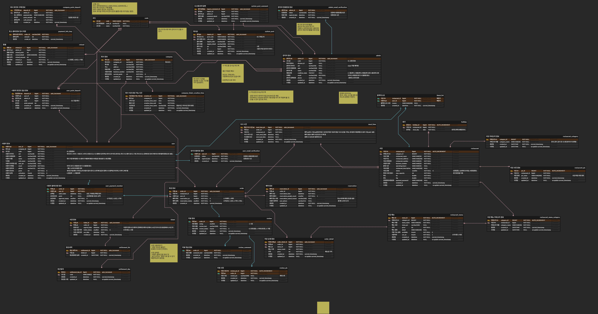
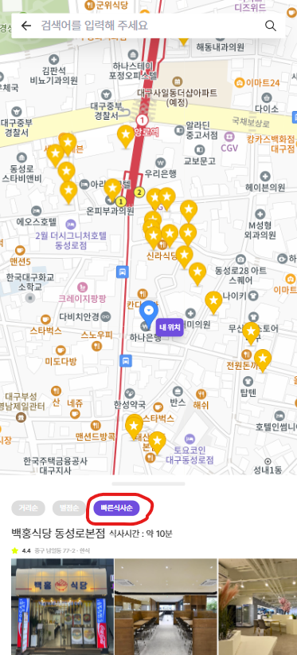
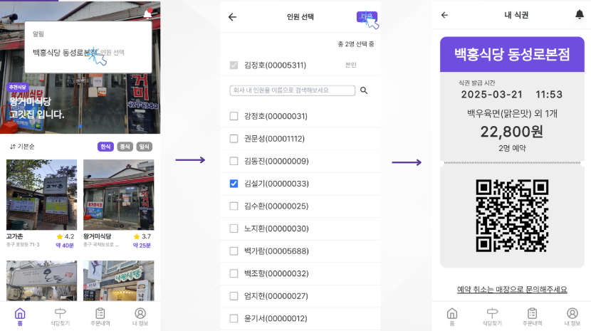
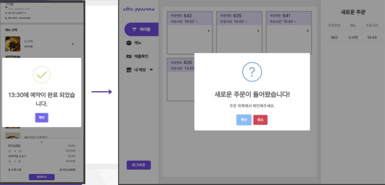
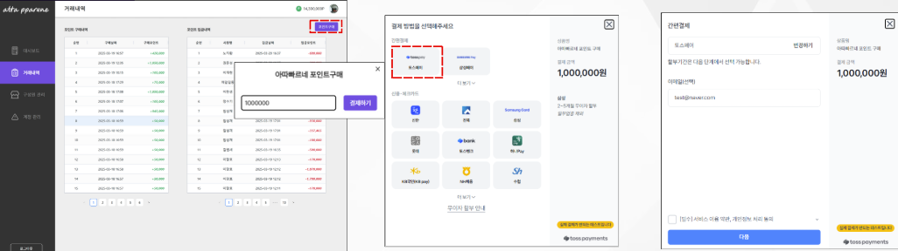

## 프로젝트 소개
>직장인들의 한정된 점심시간을 보다 효율적으로 활용할 수 있도록, 사전 예약 기능을 제공하는 식당 예약 솔루션을 개발했습니다. 사용자는 원하는 식당을 미리 예약하여 대기 시간을 줄일 수 있으며, 평균 식사시간이 짧은 식당을 빠르게 찾을 수 있도록 정렬 기능도 지원합니다.

## 개발 기간
2025.02.24 ~ 2025.03.14(약 3주)

## 개발 환경
- IntelliJ
- Postman
- GitHub

## 사용 기술
#### 주요 프레임워크 / 라이브러리(BackEnd)
- Java 11 openjdk
- SpringBoot 3.3.6
- Mybatis
- jjwt:0.12.6
- hibernate-60:3.9.1(JPA)
- SpringSecurity

#### Build tool
Gradle

## E-R 다이어그램

## 주요 기능
### 가까운 식당 조회 & 평균식사시간 순 정렬

>카카오 지도 API를 사용해 현재 위치에 3KM 반경의 식당을 조회하고 평균 식사시간 순으로 조회가 가능합니다.

### 함께결재 기능

>회사동료와 주문금액을 분배해 한번에 결재할 수 있는 시스템을 제공합니다.

### 식당관리자 실시간 알림 기능

> 사용자 예약시 식당관리자 페이지에 소켓통신을 사용한 실시간 알림이 표시됩니다.

### 회사관리자 포인트 구매 토스페이먼트 결재 기능

> 토스페이먼트를 사용해 포인트 구매를 간편히 진행할 수 있습니다.

## 담당파트
1. 실시간 알림을 위한 소켓통신 적용(SockJS & STOMP)
2. 사용자 이메일인증을 위한 SMTP서버 연동(Google SMTP 서버)
3. 포인트 구매를 위한 토스페이먼트 API 연동    
4. 도메인 및 HTTPS 적용
5. 스프링시큐리티 및 JWT 적용

## 참고자료
* [3차 팀 프로젝트 대시보드](https://www.notion.so/3-1986d625693f80cfab29d5280d07a881)
* [3차 팀 프로젝트 발표자료](https://www.canva.com/design/DAGiDtrOZbg/hjT4h26Mths_hXKFvrDTcA/edit?ui=eyJIIjp7IkEiOnRydWV9fQ)
